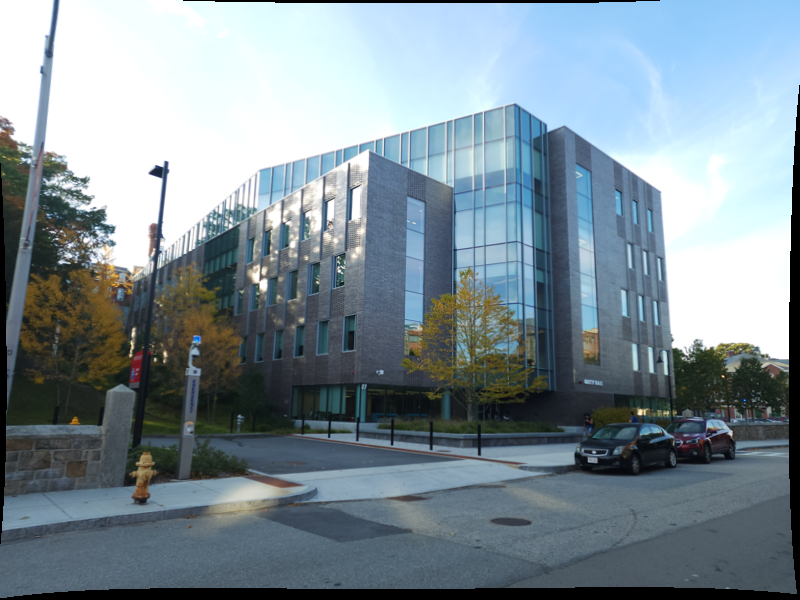
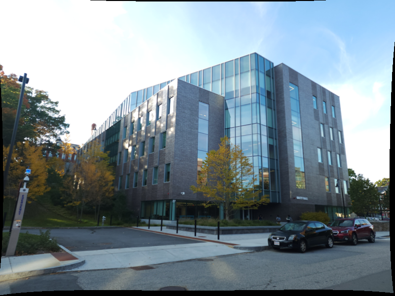
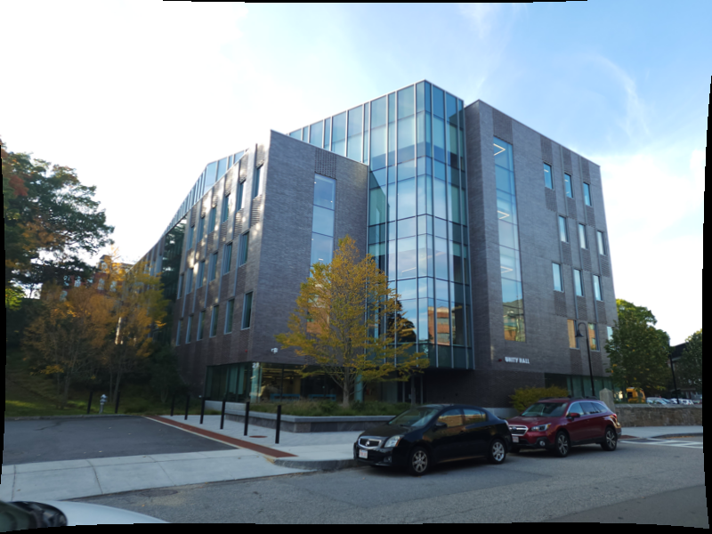
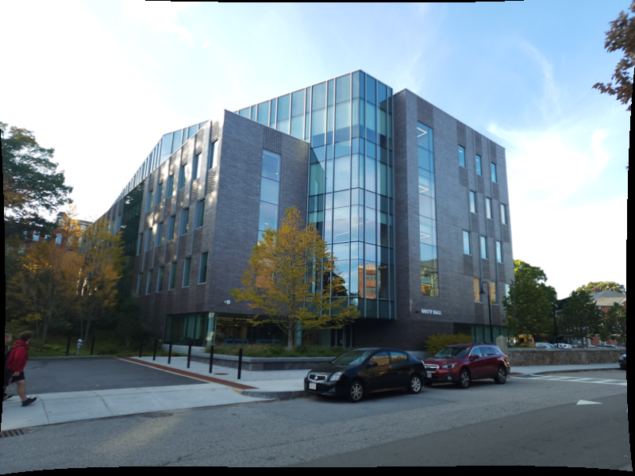
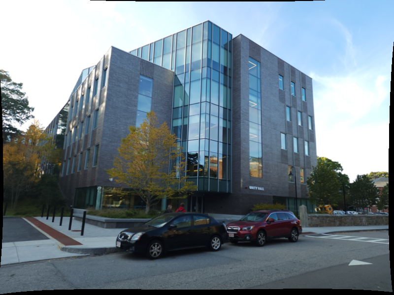
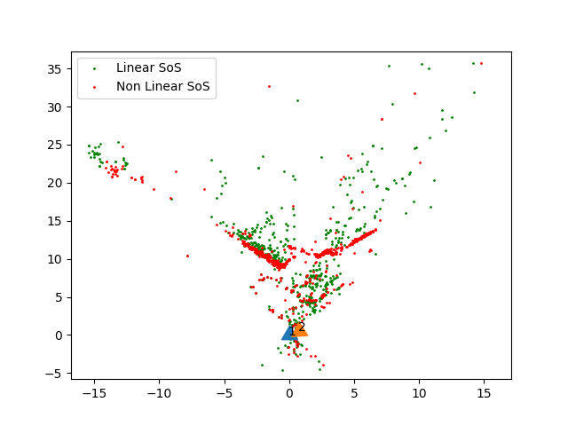
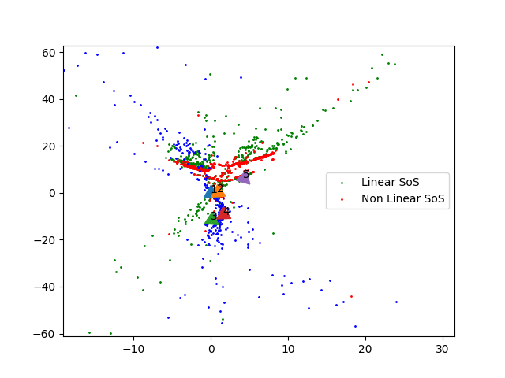

# Structure from Motion (SfM)
## Data 
The data consist of 6 images provided which are from different camera perspectives of the same building with fixed camera parameters.

<div style="display: flex; justify-content: center; flex-wrap: wrap;">
  <figure>
    
    <figcaption style="text-align: center;">Pose 1</figcaption>
  </figure>
  <figure>
    
    <figcaption style="text-align: center;">Pose 2</figcaption>
  </figure>
  <figure>
    
    <figcaption style="text-align: center;">Pose 3</figcaption>
  </figure>
  <figure>
    
    <figcaption style="text-align: center;">Pose 4</figcaption>
  </figure>
  <figure>
    
    <figcaption style="text-align: center;">Pose 5</figcaption>
  </figure>
</div>

The target poses of the camera of each image is as follows:
<p align="center">
  
</p>

## Results
The following is the result obtained from Linear and Non-Linear triangulation for camera poses 1 and 2.
<p align="center">
  
</p>

The below is the result of using Linear and Non-Linear Perspective-n-Points (PnP) on the camera poses.
<p align="center">
  
</p>

## Running the code
Run the following command in the terminal window for the program to start

```json
python3 Wrapper.py
```
